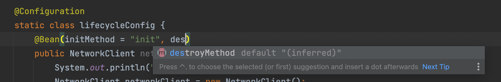

# 빈 등록 초기화, 소멸 메서드

 빈 등록 시 설정 정보에 `initMethod`, `destroyMethod`를 사용해 초기화, 소멸 메서드 지정 가능

## 예시

 설정 정보를 사용하도록 예시를 변경해 보자.

```java
public class NetworkClient {

    private String url;

    // 연결 객체 생성 및 연결, 호출 초기화
    public NetworkClient() {
        System.out.println("생성자 호출, url = " + url);
        // connect(); // 객체 생성 시 연결
        // call("초기화 연결 메시지"); // 서버 호출
    }

    public void setUrl(String url) {
        this.url = url;
    }

    // 서비스 시작 시 연결 메서드
    public void connect() {
        System.out.println("url = " + url);
    }

    // 연결한 서버에 호출 메서드
    public void call(String message) {
        System.out.println("call: " + url + ", message = " + message);
    }

    // 서비스 종료 시 연결 종료 메서드
    public void disconnect() {
        System.out.println("disconnect 호출, close " + url);
    }

    // 의존관계 주입 후 호출할 메서드
    public void init() throws Exception {
        System.out.println("NetworkClient.init");
        connect();
        call("초기화 연결 메시지");
    }

    // 빈 소멸 직전 호출할 메서드
    public void close() throws Exception {
        System.out.println("NetworkClient.close");
        disconnect();
    }
}
```

테스트 설정 정보의 `@Bean` 애노테이션에 초기화 및 소멸 메서드를 지정한다.
* `initMethod`: 빈 초기화 메서드로, `NetworkClient`의 `init` 지정
* `destroyMethod`: 빈 소멸 메서드로, `NetworkClient`의 close` 지정
```java
public class BeanLifecycleTest {

    @Test
    public void 생명주기_테스트() {

        // ApplicationContext는 close가 없음
        ConfigurableApplicationContext ac = new AnnotationConfigApplicationContext(lifecycleConfig.class);

        // NetworkClient 생성
        NetworkClient client = ac.getBean(NetworkClient.class);
        ac.close();

    }

    @Configuration
    static class lifecycleConfig {
        @Bean(initMethod = "init", destroyMethod = "close")
        public NetworkClient networkClient() {
            System.out.println("true = " + true);
            NetworkClient networkClient = new NetworkClient();
            networkClient.setUrl("http;//sirzzang.github.io"); // 빈 의존관계 주입 시 url 설정
            return networkClient; // setUrl 후 결과물이 스프링 빈으로 등록됨
        }
    }
}
```

 실행 결과를 보면 다음과 같이 초기화가 잘 된 것을 확인할 수 있다.
```java
생성자 호출, url = null
NetworkClient.init
url = http;//sirzzang.github.io
call: http;//sirzzang.github.io, message = 초기화 연결 메시지
00:47:11.892 [Test worker] DEBUG org.springframework.context.annotation.AnnotationConfigApplicationContext - Closing org.springframework.context.annotation.AnnotationConfigApplicationContext@e19bb76, started on Sat Apr 02 00:47:11 KST 2022
NetworkClient.close
disconnect 호출, close http;//sirzzang.github.io
```

## 장점
* 메서드 이름의 자유로운 지정 가능
* 스프링 빈이 스프링 프레임워크 코드에 의존하지 않음
* 코드가 아니라 설정 정보를 사용하므로, 코드를 고칠 수 없는 외부 라이브러리에도 초기화, 종료 메서드 적용 가능(*은근히 외부 라이브러리에 종료 메서드 호출해주어야 하는 경우가 많음*)
* 종료 메서드 추론 가능

### 종료 메서드 추론

 스프링 빈의 `@Bean(destroyMethod)`에는 **종료 메서드를 추론**하는 기능이 있다. 따라서 스프링 빈으로 등록할 때, 종료 메서드를 적어주지 않아도 종료 메서드 호출은 잘 동작하게 된다(라이브러리 사용 시 간편)
 


* 대부분의 라이브러리는 `close`, `shutdown` 등의 이름으로 종료 메서드를 사용
* `@Bean`의 `destroyMethod`는 기본값이 `(inferred)`로 등록되어 있음
* 해당 기능은 `close`, `shutdown` 등의 이름의 메서드를 자동으로 추론해서 종료 메서드 호출
* 이 기능을 사용하기 싫으면, `destroyMehod=""`로 빈 공백을 지정해야 함