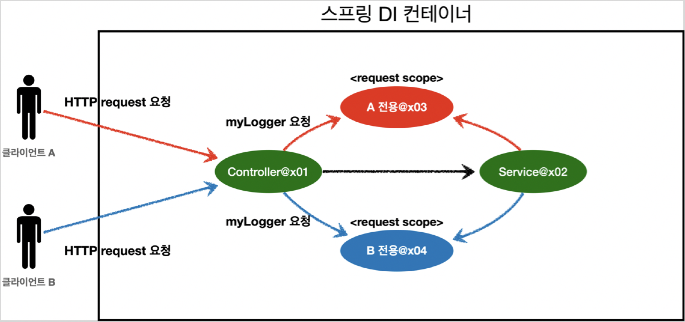

# request 스코프

## 관리



 request 스코프 빈은 HTTP 요청 하나 당 각각 할당된다.


## 예제

> gradle `implementation 'org.springframework.boot:spring-boot-starter-web'` 추가 필요

> 추가 후 어플리케이션 실행 시 `2022-04-04 16:36:55.281  INFO 8354 --- [           main] o.s.b.w.embedded.tomcat.TomcatWebServer  : Tomcat started on port(s): 8080 (http) with context path ''` 확인 가능
> 
> 스프링 부트가 내장 톰캣 서버를 활용해서 웹 서버와 스프링 어플리케이션을 함께 실행한다.

<br>

 요청 별로 UUID를 부여하고, UUID와 requestURL 등 로그를 남기는 request 스코프 빈 예제를 작성해 보자.
* request 스코프 빈(`RequestLogger`)은 HTTP 요청 시점에 요청 당 하나씩 생성
* `RequestLogger` 빈 인스턴스 생성 시 초기화 메서드를 통해 uuid 부여
* `requestURL`은 빈 인스턴스 생성 시점에 알 수 없음(외부에서 setter로 주입)
```java
@Component
@Scope(value = "request")
public class RequestLogger {

    private String uuid;
    private String RequestURL;

    public void setRequestURL(String requestURL) {
        this.RequestURL = requestURL;
    }

    public void log(String message) {
        System.out.println("[" + uuid + "]" + "[" + RequestURL + "] " + message);
    }

    // 의존관계 주입 후 빈 uuid 속성 값 설정
    @PostConstruct
    public void init() {
        uuid = UUID.randomUUID().toString();
        System.out.println("[" + uuid + "] request scope bean created: " + this);
    }

    // 소멸
    @PreDestroy
    public void close() {
        System.out.println("[" + uuid + "] request scope bean destroyed: " + this);
    }
}
```

<br>

 웹 요청에 대한 컨트롤러 예제를 만든다.
* requestURL 추출
* request 스코프 빈 `RequestLogger` 인스턴스에 requestURL 주입
* 서비스 로직 호출

> requestURL을 로거에 저장하는 것은 컨트롤러보다는 공통 처리가 가능한 스프링 인터셉터나 서블릿 필터 같은 곳에서 활용하는 것이 좋다.

```java
@Controller
@RequiredArgsConstructor
public class DemoLogController {

    private final RequestLogger requestLogger;
    private final DemoLogService demoLogService;

    @RequestMapping("log-demo")
    @ResponseBody
    public String logDemo(HttpServletRequest request) {

        String requestURL = request.getRequestURL().toString(); // request url 추출
        requestLogger.setRequestURL(requestURL); // request url 주입

        requestLogger.log("controller log");
        demoLogService.logic("sirzzang");

        return requestURL + "OK";
    }
}
```

<br>

 비즈니스 로직을 하는 서비스 계층까지 내려오도록 예제를 작성해 보자.(*아래 예제는 비즈니스 로직이랄 것은 없고, 일단 같은 request 스코프 빈에서 처리됨을 보기 위한 용도일 뿐이다*)
```java
@Service
@RequiredArgsConstructor
public class DemoLogService {

    private final RequestLogger requestLogger;

    // 비즈니스 로직 예시
    public void logic(String id) {
        requestLogger.log(id + " service log");
    }
}
```
> 사실 `requestURL`의 경우, 예제에서처럼 request 스코프의 빈을 쓰지 않고 파라미터로 서비스 계층의 빈에 넘겨도 되긴 한다.
> 
> 그러나 코드가 너무 지저분해지고, 서비스 계층으로 비즈니스 로직과 상관 없는 정보(*예컨대, `requestURL`*)가 넘어가게 된다. 웹과 관련된 부분은 컨트롤러까지만 사용하고, 서비스 계층은 웹 기술에 종속되지 않고 가급적 순수하게 유지하는 것이 좋다.


### 문제

 위와 같이 예제를 작성하고, 스프링 어플리케이션을 실행해 보자.

 다음과 같은 에러가 발생한다.

```java
> Task :CoreApplication.main() FAILED
Caused by: java.lang.IllegalStateException: No thread-bound request found: Are you referring to request attributes outside of an actual web request, or processing a request outside of the originally receiving thread? If you are actually operating within a web request and still receive this message, your code is probably running outside of DispatcherServlet: In this case, use RequestContextListener or RequestContextFilter to expose the current request.


Execution failed for task ':CoreApplication.main()'.
> Process 'command '/Library/Java/JavaVirtualMachines/jdk-11.0.13.jdk/Contents/Home/bin/java'' finished with non-zero exit value 1
```
<br>

 request 스코프 빈은 **실제 요청이 와야** 생성되기 때문에 발생한 문제다.
 
 스프링 어플리케이션 실행 시점에 스프링 컨테이너는 의존관계 주입을 위해 `RequestLogger` 빈 인스턴스를 찾는다. 그러나 `RequestLogger`는 request 스코프 빈이므로, 스프링 컨테이너가 뜨는 시점에는 그 인스턴스가 생성되어 있지 않다. 요청이 아무 것도 없기 때문이다. 

<br>

### 해결

 request 스코프의 빈 조회를 **필요한 시점(HTTP 요청이 오는 시점)까지 지연**함으로써 문제를 해결할 수 있다. 스프링 컨테이너에게 request 스코프 빈을 요청하는 것을, 의존관계 주입 시점이 아니라 실제 요청이 올 때까지로 미루는 것이다.

#### provider

 컨트롤러, 서비스 모두 `ObjectProvider`를 통해 요청이 오는 시점에 request 스코프 빈 인스턴스를 받도록 변경하면 된다.
* 컨트롤러, 서비스는 의존관계 탐색 후 인스턴스를 반환하는 `ObjectProvider`를 주입 받음
* `getObject`로 스프링 컨테이너 `ObjectProvider`에 요청하는 순간에 `RequestLogger` 인스턴스 생성

```java
@Controller
@RequiredArgsConstructor
public class DemoLogController {

    private final ObjectProvider<RequestLogger> requestLoggerProvider;
    private final DemoLogService demoLogService;

    @RequestMapping("log-demo")
    @ResponseBody
    public String logDemo(HttpServletRequest request) {

        String requestURL = request.getRequestURL().toString(); 

        // provider를 통해 request 스코프 빈 인스턴스 주입
        RequestLogger requestLogger = requestLoggerProvider.getObject();
        requestLogger.setRequestURL(requestURL); 

        requestLogger.log("controller log");
        demoLogService.logic("sirzzang");

        return requestURL + "OK";
    }
}
```
```java
@Service
@RequiredArgsConstructor
public class DemoLogService {

    private final ObjectProvider<RequestLogger> requestLoggerProvider;

    public void logic(String id) {

        RequestLogger requestLogger = requestLoggerProvider.getObject();
        requestLogger.log(id + " service log");
    }
}
```

 실행 후 `demo-log`로 요청 시, `ObjectProvider` 덕분에 스프링 컨테이너에 빈 요청이 지연되고, 의도한 대로 동작하는 것을 확인할 수 있다.
```bash
curl -X GET localhost:8080/log-demo
```
```java
[b4f147b7-0abd-4519-a600-4946bb0092ab] request scope bean created: hello.core.common.RequestLogger@5436a1ed
[b4f147b7-0abd-4519-a600-4946bb0092ab][http://localhost:8080/log-demo] controller log
[b4f147b7-0abd-4519-a600-4946bb0092ab][http://localhost:8080/log-demo] sirzzang service log
[b4f147b7-0abd-4519-a600-4946bb0092ab] request scope bean destroyed: hello.core.common.RequestLogger@5436a1ed
```
<br>

 동시에 여러 요청이 올 때 각각 다른 인스턴스가 관리하는 것을 확인하기 위해 스레드에 슬립을 걸어 보자.
```java
@Controller
@RequiredArgsConstructor
public class DemoLogController {

    private final ObjectProvider<RequestLogger> requestLoggerProvider;
    private final DemoLogService demoLogService;

    @RequestMapping("log-demo")
    @ResponseBody
    public String logDemo(HttpServletRequest request) throws InterruptedException {

        String requestURL = request.getRequestURL().toString();

        RequestLogger requestLogger = requestLoggerProvider.getObject();
        requestLogger.setRequestURL(requestURL); 

        requestLogger.log("controller log");
        Thread.sleep(2000); // 쓰레드 슬립
        demoLogService.logic("sirzzang");

        return requestURL + "OK";
    }
}
```
```java
[7e0b2b69-f5d3-4148-9a3f-736495e60876] request scope bean created: hello.core.common.RequestLogger@23e72754
[7e0b2b69-f5d3-4148-9a3f-736495e60876][http://localhost:8080/log-demo] controller log
[b24de3fe-895c-4664-979b-111fd0d85213] request scope bean created: hello.core.common.RequestLogger@3285a1d6
[b24de3fe-895c-4664-979b-111fd0d85213][http://localhost:8080/log-demo] controller log
[3e65c246-5e8e-4aa0-80c4-d32ac1e26ef6] request scope bean created: hello.core.common.RequestLogger@60b96e22
[3e65c246-5e8e-4aa0-80c4-d32ac1e26ef6][http://localhost:8080/log-demo] controller log
[7e0b2b69-f5d3-4148-9a3f-736495e60876][http://localhost:8080/log-demo] sirzzang service log
[7e0b2b69-f5d3-4148-9a3f-736495e60876] request scope bean destroyed: hello.core.common.RequestLogger@23e72754
[56583749-d3ec-4bf0-8ab1-65d11e2b87da] request scope bean created: hello.core.common.RequestLogger@4ff19df9
[56583749-d3ec-4bf0-8ab1-65d11e2b87da][http://localhost:8080/log-demo] controller log
```

<br>

#### proxy 모드

 `RequestLogger` 빈을 프록시 모드로 동작시켜도 된다(*예제 상에서는 코드를 원래 문제가 발생했을 때로 복구시켜야 한다*)
```java
@Component
@Scope(value = "request", proxyMode = ScopedProxyMode.TARGET_CLASS) // 프록시 모드
public class RequestLogger {

    private String uuid;
    private String RequestURL;

    public void setRequestURL(String requestURL) {
        this.RequestURL = requestURL;
    }

    public void log(String message) {
        System.out.println("[" + uuid + "]" + "[" + RequestURL + "] " + message);
    }

    @PostConstruct
    public void init() {
        uuid = UUID.randomUUID().toString();
        System.out.println("[" + uuid + "] request scope bean created: " + this);
    }

    @PreDestroy
    public void close() {
        System.out.println("[" + uuid + "] request scope bean destroyed: " + this);
    }
}
```
<br>

 `requestLogger`가 어떤 클래스인지 확인해 보자.
* `CGLIB`으로 만들어진 가짜 프록시 객체 확인 가능
* 가짜 프록시 객체는 싱글톤처럼 동작
```java
requestLogger = class hello.core.common.RequestLogger$$EnhancerBySpringCGLIB$$ab135d17
[5078aee5-095f-4db2-ad96-76f88f81120e] request scope bean created: hello.core.common.RequestLogger@279b0e21
[5078aee5-095f-4db2-ad96-76f88f81120e][http://localhost:8080/log-demo] controller log
[5078aee5-095f-4db2-ad96-76f88f81120e][http://localhost:8080/log-demo] sirzzang service log
[5078aee5-095f-4db2-ad96-76f88f81120e] request scope bean destroyed: hello.core.common.RequestLogger@279b0e21
requestLogger = class hello.core.common.RequestLogger$$EnhancerBySpringCGLIB$$ab135d17
[108fed7f-570a-492f-97c1-7051edcd8542] request scope bean created: hello.core.common.RequestLogger@a8c6d26
[108fed7f-570a-492f-97c1-7051edcd8542][http://localhost:8080/log-demo] controller log
[108fed7f-570a-492f-97c1-7051edcd8542][http://localhost:8080/log-demo] sirzzang service log
[108fed7f-570a-492f-97c1-7051edcd8542] request scope bean destroyed: hello.core.common.RequestLogger@a8c6d26
```
<br>
 프록시 모드를 사용할 경우, 스프링 컨테이너는 해당 모드를 사용한 빈의 가짜 프록시 객체를 만들어 주입한다. 이 가짜 프록시 객체에는 내부의 실제 빈을 요청하는 로직이 있다.

 즉, `RequestLogger` 빈을 프록시 모드로 지정하면, 다음과 같은 과정을 거쳐 동작하게 된다.
* 스프링 컨테이너는 최초에 `CGLIB` 라이브러리로 실제 `RequestLogger` 클래스를 상속 받은 가짜 프록시 객체 생성 
  * 가짜 프록시 객체는 request 스코프와 무관하게, 내부에 단순한 위임 로직(*실제 빈을 찾는 방법*)만 있음
    * CGLIB 라이브러리로 실제 클래스를 상속받은 가짜 프록시 객체 생성 후 주입
  * 가짜 프록시 객체는 싱글톤처럼 동작
* 클라이언트는 가짜 프록시 객체를 호출
* 가짜 프록시 객체가 진짜 빈의 로직을 호출하는데, 이 때 request 스코프 빈 인스턴스가 생성됨


 프록시 객체 덕분에, 클라이언트는 마치 싱글톤 빈을 사용하듯 편리하게 request 스코프 빈을 사용할 수 있다. 

 그러나, 싱글톤을 사용하는 것 같아도 내부 동작은 다르기 때문에 주의해야 한다.

> provider처럼, 프록시 역시 웹 스코프가 아니어도 사용할 수 있다.

> `ObjectProvider`를 사용하든 프록시 객체를 사용하든 핵심은 빈 요청을 지연하는 것이다. 다만, 애노테이션 설정 변경만으로 원본 객체를 프록시 객체로 대체할 수 있다는 것은 **다형성**과 **DI 컨테이너**가 가진 큰 장점이다.
