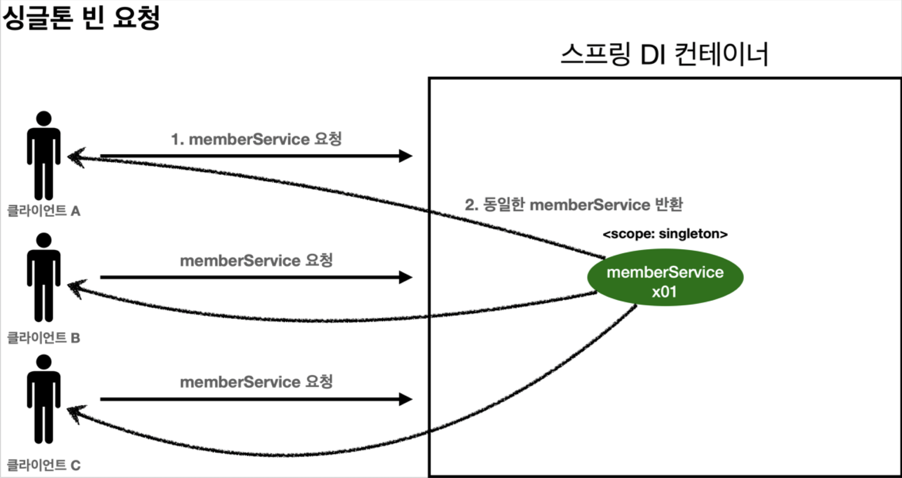

# 싱글톤 스코프

 싱글톤 스코프의 빈 조회 시, 스프링 컨테이너는 **항상 같은** 스프링 빈을 반환한다.

## 싱글톤 빈 관리



1. 클라이언트의 싱글톤 스코프 스프링 빈(`MemberService`) 요청
2. 스프링 컨테이너는 자신이 관리하는 싱글톤 스코프 스프링 빈 반환
3. 이후에 스프링 컨테이너에 같은 요청이 와도, 같은 스프링 빈 인스턴스 반환 

즉, 클라이언트는 항상 동일한 주소의 스프링 빈 인스턴스를 공유해서 사용한다.

### 예제

 싱글톤 스코프의 빈이 항상 같은 인스턴스인지 확인하는 테스트를 작성해 보자.
 * `@Scope("singleton")`
 * `ApplicationContext`도 컴포넌트 스캔의 대상이기 때문에, `@Component` 애노테이션 없어도 무방

```java
public class SingletonTest {

    @Test
    @DisplayName("싱글톤 빈 요청 시 같은 인스턴스가 반환된다.")
    public void 싱글톤_빈_테스트() {

        // given
        ConfigurableApplicationContext ac = new AnnotationConfigApplicationContext(SingletonBean.class); // applicationcontext도 컴포넌트 스캔의 대상

        // when
        System.out.println("SingletonBean 요청 1");
        SingletonBean singletonBean1 = ac.getBean(SingletonBean.class);
        System.out.println("SingletonBean 요청 2");
        SingletonBean singletonBean2 = ac.getBean(SingletonBean.class);

        // then
        assertThat(singletonBean1).isSameAs(singletonBean2);
        System.out.println("singletonBean1 = " + singletonBean1);
        System.out.println("singletonBean2 = " + singletonBean2);
        
        ac.close();
    }

    @Scope("singleton")
    static class SingletonBean {
        @PostConstruct
        public void init() {
            System.out.println("SingletonBean.init");
        }

        @PreDestroy
        public void destroy() {
            System.out.println("SingletonBean.destroy");
        }
    }
}
```
 실행 결과를 확인해 보자. 인스턴스가 먼저 만들어지고 요청 시 만들어진 것을 반환하는 것을 확인할 수 있다.
* 스프링 빈의 메모리 주소가 같음
* 초기화 메서드가 한 번만 호출됨
* 컨텍스트 종료 시 소멸 메서드 호출

```java
SingletonBean.init
SingletonBean 요청 1
SingletonBean 요청 2
singletonBean1 = hello.core.scope.SingletonTest$SingletonBean@47428937
singletonBean2 = hello.core.scope.SingletonTest$SingletonBean@47428937
SingletonBean.destroy
```
