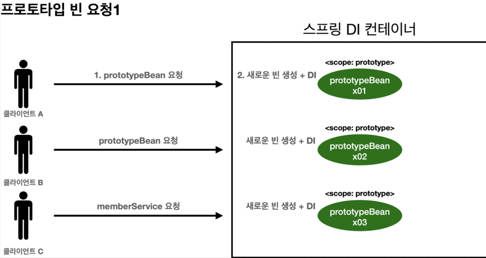
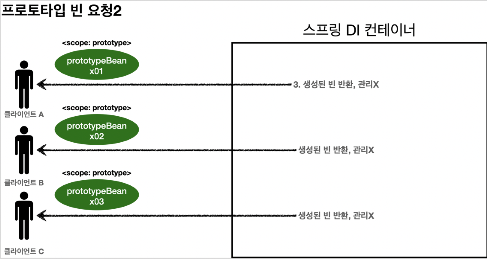

# 프로토타입 스코프

 프로토타입 스코프의 싱글톤 빈 조회 시, 스프링 컨테이너는 조회할 때마다 항상 새로운 인스턴스를 생성해서 반환한다. **요청할 때마다** 새로운 프로토타입 빈 인스턴스를 만들어 사용하고 싶은 경우에 사용하면 된다.

## 특징

* 스프링 컨테이너에 요청할 때마다 새로 생성
* 스프링 컨테이너는 프로토타입 빈의 생성과 의존관계 주입, 초기화까지만 관여
* 이후의 관리는 스프링 프로토타입 빈을 조회한 클라이언트가 담당(*예: 종료 메서드 호출*)

### 관리




1. 클라이언트가 프로토타입 스코프 스프링 빈(`prototypeBean`) 요청
2. 스프링 컨테이너는 요청 시점에 프로토타입 스코프 스프링 빈 인스턴스를 생성하고, 필요한 의존관계를 주입
   * A의 요청 → `prototypeBeanx01` 생성
   * B의 요청 → `prototypeBeanx02` 생성
   * C의 요청 → `prototypeBeanx03` 생성
3. 스프링 컨테이너는 생성, 의존관계 주입 후 클라이언트에게 반환
   * 스프링 컨테이너는 빈 생성, 의존관계 주입, 초기화(콜백 메서드)까지만 처리
   * 클라이언트에게 반환 후, 스프링 컨테이너는 해당 빈을 더 이상 관리하지 않음
4. 이후에 스프링 컨테이너에 동일한 요청이 올 때마다, 위와 같은 방식으로 새로운 프로토타입 빈을 생성해서 반환

 즉, 클라이언트는 프로토타입 스코프 빈을 요청할 때마다 다른 스프링 빈 인스턴스를 반환받게 된다. 또한, 반환된 프로토타입 스코프의 스프링 빈을 관리할 책임은 클라이언트에게 있다. 예컨대, `@PreDestroy`와 같은 메서드는 호출되지 않는다.

### 예제

 프로토타입 빈이 요청할 때마다 새로 생성되는 것임을 확인하는 테스트를 작성해 보자.
```java
public class PrototypeTest {

   @Test
   @DisplayName("프로토타입 빈 요청 시 다른 인스턴스가 반환된다.")
   public void 프로토타입_빈_테스트() {
      // given
      ConfigurableApplicationContext ac = new AnnotationConfigApplicationContext(PrototypeBean.class);

      // when
      System.out.println("PrototypeBean 요청 1");
      PrototypeBean prototypeBean1 = ac.getBean(PrototypeBean.class);
      System.out.println("PrototypeBean 요청 2");
      PrototypeBean prototypeBean2 = ac.getBean(PrototypeBean.class);

      // then
      assertThat(prototypeBean1).isNotEqualTo(prototypeBean2);
      System.out.println("prototypeBean1 = " + prototypeBean1);
      System.out.println("prototypeBean2 = " + prototypeBean2);
      
      ac.close();
   }

   @Scope("prototype")
   static class PrototypeBean {
      @PostConstruct
      public void init() {
         System.out.println("PrototypeBean.init");
      }

      @PreDestroy
      public void destroy() {
         System.out.println("PrototypeBean.destroy");
      }
   }
}
```

 실행 결과를 확인해 보자. 요청 시 인스턴스 만들어지고, 이후 만들어진 인스턴스를 반환하는 것을 알 수 있다.
* 스프링 빈 인스턴스 메모리 주소가 다름
* 초기화 메서드가 2번 호출됨
* 소멸 메서드가 호출되지 않음

```java
PrototypeBean 요청 1
PrototypeBean.init
PrototypeBean 요청 2
PrototypeBean.init
prototypeBean1 = hello.core.scope.PrototypeTest$PrototypeBean@47428937
prototypeBean2 = hello.core.scope.PrototypeTest$PrototypeBean@3b9d6699
```

## 싱글톤 빈에서의 사용

스프링 컨테이너에서 싱글톤 빈과 프로토타입 빈을 함께 사용할 때, 싱글톤 빈 생성 시 주입 받은 프로토타입 빈이 계속해서 유지되어 문제가 발생할 수 있다. 이 경우, provider로 문제를 해결해야 한다.

### 문제

프로토타입 빈을 사용할 때의 의도는, **프로토타입 빈을 사용하고자 하는 시점마다 새로 생성해서 사용하는 것**이다.

그런데 스프링은 일반적으로 싱글톤 빈을 사용하므로, (*위와 같은 의도를 가지고 있다 하더라도, 잘 설계하지 않으면*) 싱글톤 빈이 프로토타입 빈을 사용하게 될 것이다. 이 경우, 싱글톤 빈은 생성 시점에만 의존관계를 주입받기 때문에, **싱글톤 빈 생성 시점에 주입된 프로토타입 빈이 함께 유지되며** 문제가 발생한다. 
> 싱글톤 빈에서 프로토타입 빈을 주입 받는 시점에만 새로운 프로토타입 빈이 생성된다. 
> 
> 즉, 여러 싱글톤 빈에서 같은 프로토타입 빈을 주입 받는다면, 주입 받는 시점에 각각 새로운 프로토타입 빈이 생성되어 각 싱글톤 빈에 주입된다. 이후 주입 받은 인스턴스가 각각의 싱글톤 빈 안에서 유지되는 것은 동일하다.

<br>

 싱글톤 빈(`ClientBean`)이 프로토타입 빈(`PrototypeBean`)을 사용하는 테스트를 작성해 보자.
* `clientBean`: 싱글톤 빈
  * 스프링 컨테이너 생성 시점에 함께 생성
  * 의존관계 주입 시점에 `prototypeBean` 요청
  * 스프링 컨테이너가 `prototypeBean`를 생성해 `clientBean`에 반환
  * `clientBean`은 `prototypeBean`의 참조값을 내부 필드에 보관
* 클라이언트가 `clientBean`의 `logic` 호출 시 이미 보관되어 있는 `prototypeBean`의 `addCount` 호출

```java
public class SingletonWithPrototypeTest {
    
    @Test
    @DisplayName("싱글톤 빈이 프로토타입 빈 사용 시, 처음 주입된 프로토타입 빈 인스턴스가 계속해서 사용된다.")
    public void 싱글톤_빈에서_프로토타입_빈_사용_테스트() {

        // given
        AnnotationConfigApplicationContext ac = new AnnotationConfigApplicationContext(PrototypeBean.class, ClientBean.class);

        // when
        ClientBean clientBean1 = ac.getBean(ClientBean.class);
        int count1 = clientBean1.logic();

        ClientBean clientBean2 = ac.getBean(ClientBean.class);
        int count2 = clientBean2.logic();

        // then
        assertThat(count1).isEqualTo(1);
        assertThat(count2).isEqualTo(2);
    }

    @Scope("prototype")
    @Getter
    static class PrototypeBean {

        private int count = 0;

        public void addCount() {
            System.out.println("PrototypeBean.addCount " + this);
            count++;
        }

        @PostConstruct
        public void init() {
            System.out.println("PrototypeBean.init " + this);
        }

        @PreDestroy
        public void destroy() {
            System.out.println("PrototypeBean.destroy " + this);
        }
    }

    @Scope("singleton")
    static class ClientBean {
        private final PrototypeBean prototypeBean; // 생성 시점에 의존관계 주입

        @Autowired
        public ClientBean(PrototypeBean prototypeBean) {
            this.prototypeBean = prototypeBean;
        }

        public int logic() {
            System.out.println("ClientBean.logic");
            prototypeBean.addCount();
            return prototypeBean.getCount();
        }
    }
}
```

 실행 결과를 확인해 보면, `ClientBean`의 `logic` 메서드 호출 시마다 동일한 `PrototypeBean` 인스턴스를 사용하고 있음을 알 수 있다.
```java
ClientBean.logic
PrototypeBean.addCount hello.core.scope.SingletonWithPrototypeTest$PrototypeBean@452ba1db
ClientBean.logic
PrototypeBean.addCount hello.core.scope.SingletonWithPrototypeTest$PrototypeBean@452ba1db
```

### 해결

 의존관계 주입을 매번 요청하거나, 의존관계를 탐색하는 방식으로 문제를 해결할 수 있다.
* 스프링 컨테이너에 요청
* 의존관계 탐색
  * `ObjectProvider` 사용
  * 자바 표준 `Provider` 사용

#### 스프링 컨테이너에 요청

 싱글톤 빈이 프로토타입 빈을 사용할 때마다 스프링 컨테이너에 의존관계 주입을 새로 요청할 수 있다.

```java
@Scope("singleton")
static class ClientBean {

    @Autowired
    private ApplicationContext applicationContext;

    public int logic() {
        // 로직 호출 시 프로토타입 빈 인스턴스 다시 주입 요구
        PrototypeBean prototypeBean = applicationContext.getBean(PrototypeBean.class);
        prototypeBean.addCount();
        return prototypeBean.getCount();
    }
}
```


그러나 좋은 방법이 아니다. 프로토타입 빈이 필요한 시점에만 새로 생성하면 되는데, 굳이 스프링의 어플리케이션 컨텍스트 전체를 주입할 필요가 없기 때문이다. **프로토타입 빈을 주입 받은 빈이 프로토타입 빈을 사용할 때, 새로운 인스턴스를 생성해서 제공하기만 하면** 된다.

 이를 위해 지정된 프로토타입 빈을 컨테이너에서 대신 찾아주는 **의존관계 탐색** 기능이 필요하다.
> 의존관계 탐색은 ~~당연하게도~~ 프로토타입 빈만을 위해 사용하는 기능은 아니다.

<br>


#### `ObjectProvider`, `ObjectFactory` 사용

 스프링의 `ObjectProvider`를 이용해, 스프링 컨테이너가 의존관계를 탐색해 필요할 때 새로운 인스턴스를 생성해 주입하도록 할 수 있다.


```java
@Scope("singleton")
@RequiredArgsConstructor
static class ClientBean {
    private final PrototypeBean prototypeBean;

    @Autowired
    private ObjectProvider<PrototypeBean> prototypeBeanObjectProvider; // provider 의존관계 필드 주입

    public int logic() {
        PrototypeBean prototypeBean = prototypeBeanObjectProvider.getObject(); // 새로운 프로토타입 빈 인스턴스 생성 후 반환
        prototypeBean.addCount();
        return prototypeBean.getCount();
    }
}
```

 매번 스프링 컨테이너에 요청할 때에 비해 의존관계 탐색 정도의 기능만 제공하면서도 항상 새로운 프로토타입 빈을 생성해 반환한다. 다만, 스프링에 의존적인 코드를 작성하게 된다.


<br>

#### JSR-330 `Provider` 사용

 자바 표준 `javax.inject.Provider`를 사용할 수 있다.
> gradle에 `implementation 'javax.inject:javax.inject:1`를 추가해야 한다.

```java
@Scope("singleton")
@RequiredArgsConstructor
static class ClientBean {
    private final PrototypeBean prototypeBean;

    @Autowired
    private Provider<PrototypeBean> prototypeBeanObjectProvider;

    public int logic() {
        PrototypeBean prototypeBean = prototypeBeanObjectProvider.get();
        prototypeBean.addCount();
        return prototypeBean.getCount();
    }
}
```

 실행하면, 새로운 프로토타입 빈 인스턴스가 반환되는 것을 확인할 수 있다. 기능이 매우 단순하며, 스프링에 의존적이지 않지만, 별도의 라이브러리가 필요하다.
 
# 결론
* 프로토타입 빈은 사용할 때마다 **의존관계 주입이 필요한, 새로운 객체가 필요할 때** 사용한다.
  * 실무에서는 싱글톤 빈으로 대부분의 문제를 해결할 수 있기 때문에, 프로토타입 빈을 사용할 일은 많지 않다.
* **싱글톤 빈에서 프로토타입 빈을 사용**해야 할 경우, `ObjectProvider`, JSR303 `Provider` 등을 사용해 의도치 않은 문제 발생을 막자.
  * 위 provider는 DL이 필요한 경우 언제든 사용할 수 있다.
  * (드물지만) 스프링이 아닌 다른 컨테이너에서도 필요한 경우라면, JSR303 `Provider`를 쓰면 되고, 그렇지 않으면 스프링의 `ObjectProvider`를 쓰면 된다.


